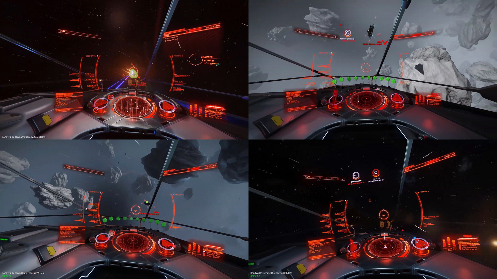
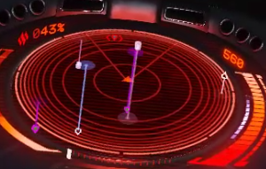
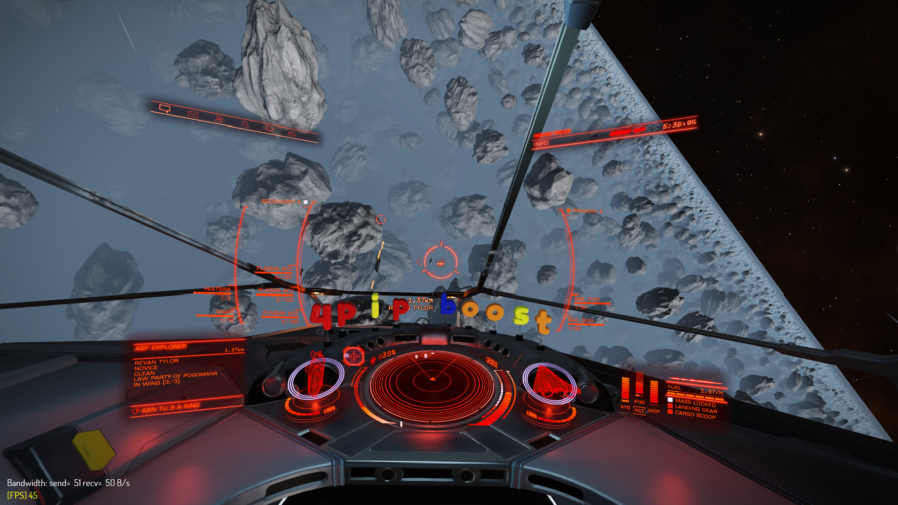
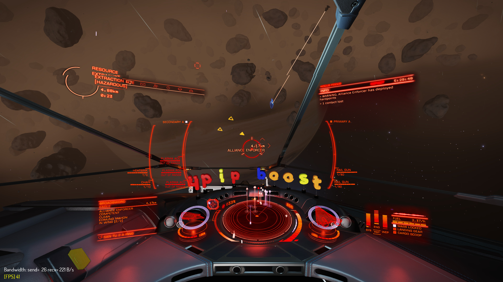
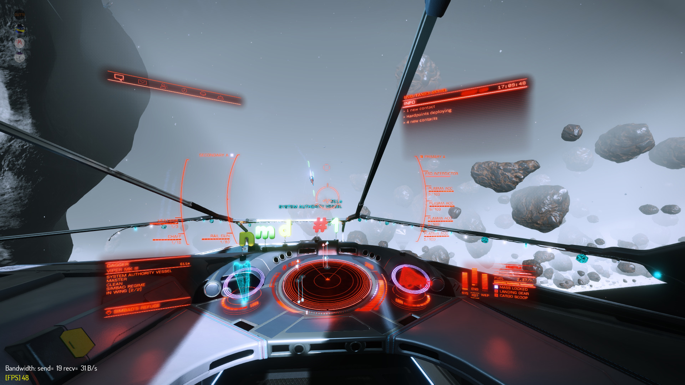
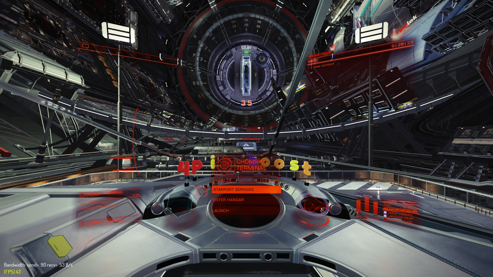
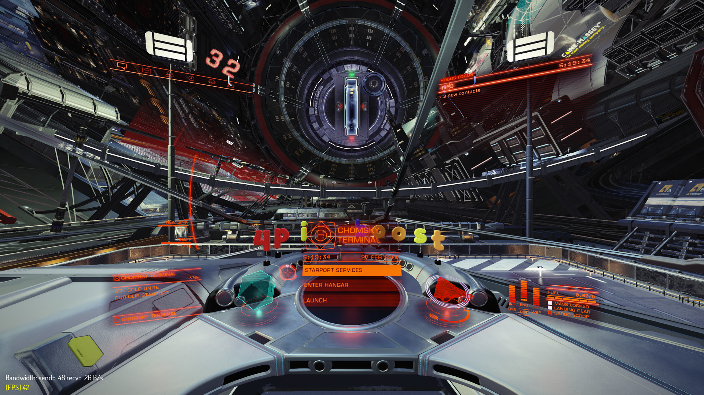
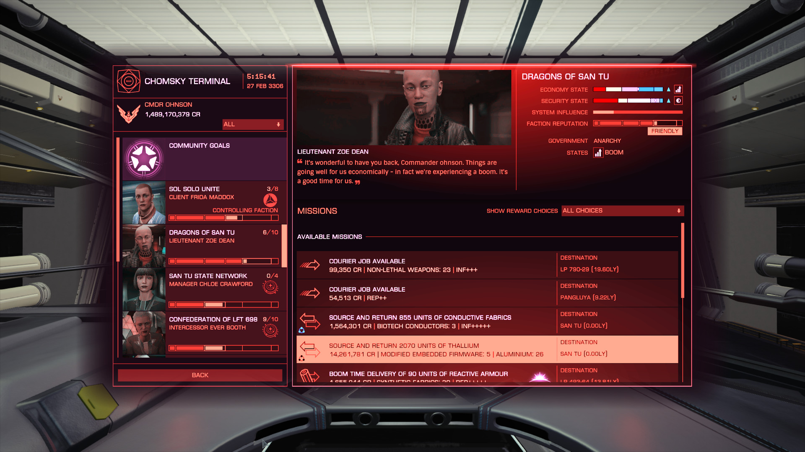

# Bunsen Hud - High Performance, High Visibility Elite Dangerous HUD colour matrix


Bunsen Hud is a HUD colour scheme aimed at providing clear information regardless of the environment.

By changing the HUD brightness factor in your ship's setting panels, you can adjust this HUD for regular travel by setting a low brightness, or raise the brightness factor to make the reticle stand out in asteroid belts with heavy fog.

**The default recommended HUD brightness factor is around _6/10_ for the best balance between reticle visibility and HUD bloom**

## Installation
If you already have a `GraphicsConfigurationOverride.xml` file, you can simply start using it by replacing the values in the color matrix with the values below:

```
<MatrixRed> 3.5, -0.2, -0.3 </MatrixRed>
<MatrixGreen> 0, 2, 2 </MatrixGreen>
<MatrixBlue> 0.5, -0.2, 1.5 </MatrixBlue>
```

If this is your first time using a custom HUD colour scheme, please refer to the platform-specific instructions below to see where you should put the `GraphicsConfigurationOverride.xml` file.

### Installation - Windows
The `GraphicsConfigurationOverride.xml` file should be placed in the Graphics folder at `<drive>:\Users\<user>\AppData\Local\Frontier Developments\Elite Dangerous\Options\Graphics\`

### Installation - GNU/Linux
For Steam/Proton users, the Elite Dangerous AppData Graphics settings folder is located at `STEAM_ROOT_FOLDER/steamapps/compatdata/359320/pfx/drive_c/users/steamuser/Local Settings/Application Data/Frontier Developments/Elite Dangerous/Options/Graphics/`

Simply download the `GraphicsConfigurationOverride.xml` from this git repository and copy the file into the Graphics folder to install Bunsen Hud.

## Screenshots
#### Hostile players as they appear on radar. Direct hostiles are shown as red, while wing hostiles are shown as purple/pink.


#### Bunsen HUD inside a regular icy ring, with the interface brightness set to the recommended value of '6'.


#### The HUD as it appears inside a normal rocky ring, with the interface brightness set to the recommended value of '6'. The reticle easily stands out even above the thickest of the ring's haze.


#### The HUD reticle as it appears on EXTREME levels of fog (present in particular types of rocky rings). If this were the default hud, the reticle would be barely visible above such heavy fog.


#### Hud brightness set to lowest ('0'), while parked on a landing pad.


#### Hud brightness set to maximum ('10'), while parked on a landing pad.


#### The NPC portraits appear perfectly normal, without any weird colour filters.


## Videos
All videos are recorded with the recommended HUD brightness of 6/10.

#### Open Space
https://www.youtube.com/watch?v=4RrjMDVVMKU

https://www.youtube.com/watch?v=JRe2u_O9RC0

#### Icy Rings
https://www.youtube.com/watch?v=1K4S2pzWe8U

## Copyright
Bunsen Hud is licenced under the [WTFPL](LICENSE).
