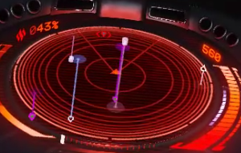
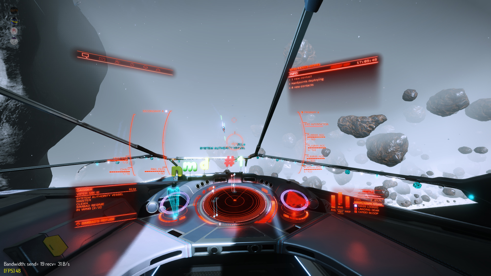

# Bunsen Hud - High Performance, High Visibility Elite Dangerous HUD colour matrix
Bunsen Hud is a custom designed colour scheme, aimed at providing clear information regardless of the environment.

By changing the HUD brightness factor in your ship's setting panels, you can adjust the HUD for regular travel by setting a low brightness, or raise the brightness factor to make the reticle stand out in asteroid belts with heavy fog.

**The default recommended HUD brightness factor is _6/10_ for the best balance between reticle visibility and HUD bloom**

## Installation
If you already have a `GraphicsConfigurationOverride.xml` file, you can simply start using it by replacing the values in the color matrix with the values below:

```
<MatrixRed> 3.5, -0.2, -0.3 </MatrixRed>
<MatrixGreen> 0, 2, 2 </MatrixGreen>
<MatrixBlue> 0.5, -0.2, 1.5 </MatrixBlue>
```

If this is your first time using a custom HUD colour scheme, please refer to the platform-specific instructions below to see where you should put the `GraphicsConfigurationOverride.xml` file.

### Installation - Windows
WIP

### Installation - GNU/Linux
For Steam/Proton users, the Elite Dangerous AppData Graphics settings folder is located at `STEAM_ROOT_FOLDER/steamapps/compatdata/359320/pfx/drive_c/users/steamuser/Local Settings/Application Data/Frontier Developments/Elite Dangerous/Options/Graphics/`

Simply download the `GraphicsConfigurationOverride.xml` from this git repository and copy the file into the Graphics folder to install Bunsen Hud.

## Screenshots - WIP
#### Hostile players as they appear on radar. Direct hostiles are shown as red, while wing hostiles are shown as purple/pink.



#### The Bunsen HUD reticle above EXTREME levels of fog (present in particular types of rocky rings). The reticle of the default hud would not be visible above such heavy fog.


## Videos - WIP

## Copyright
Bunsen Hud is licenced under the [WTFPL](LICENSE).
